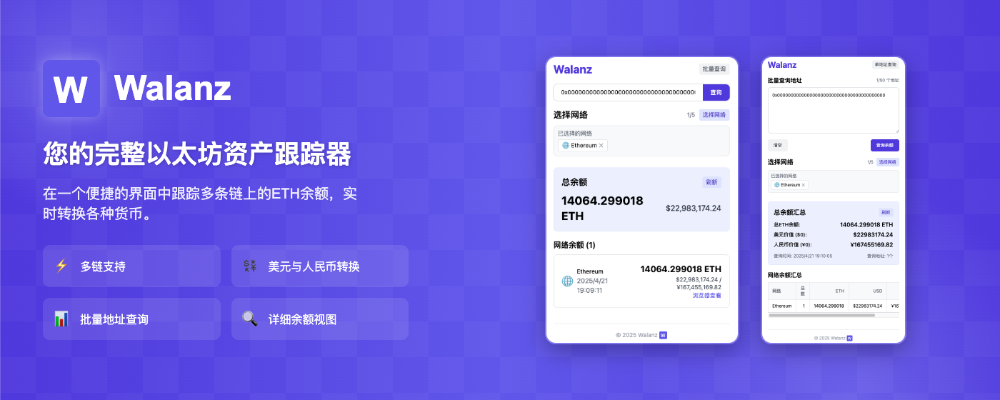

<p align="center">
  
</p>

<h1 align="center">Walanz</h1>

<p align="center">多链以太坊余额查询工具</p>

<div align="center">
  <a href="#功能特性">功能特性</a> •
  <a href="#组件">组件</a> •
  <a href="#快速开始">快速开始</a> •
  <a href="#技术栈">技术栈</a> •
  <a href="#许可证">许可证</a> •
  <a href="./README.md">English</a>
</div>



---

## 功能特性

- ✅ **多链支持**: 查询多个以太坊兼容链上的 ETH 余额
- ✅ **批量地址查询**: 同时检查多个钱包地址
- ✅ **实时价格转换**: 自动转换为 USD 和 CNY
- ✅ **多平台支持**: 提供浏览器扩展和 API 服务
- ✅ **区块浏览器集成**: 直接链接到区块浏览器获取详细信息

## 组件

### 🧩 浏览器扩展

从浏览器快速查询余额的 Chrome 扩展。

- 单个地址和批量地址查询
- 灵活的区块链选择
- 直观的界面与清晰的余额显示
- 实时价格转换

[扩展指南 →](./extension/README-zh.md)

### 🚀 服务

用于程序化余额查询的 RESTful API 服务。

- 通过 viem 支持多条链
- 针对 Vercel 优化的无服务器架构
- 完整的 API 与 Swagger 文档
- 高效的批量操作

[服务文档 →](./service/README-zh.md)

## 快速开始

### 扩展安装

1. 从 Chrome 网上应用店下载或从源码构建
2. 点击浏览器工具栏中的 Walanz 图标
3. 输入以太坊地址并选择要查询的链

### API 使用

```bash
# 查询余额的示例 API 调用
curl -X POST https://walanz.vercel.app/addresses/balances \
  -H "Content-Type: application/json" \
  -d '{"addresses":["0x123..."], "chains":["ethereum", "optimism"]}'
```

## 技术栈

- **前端**: React, TypeScript, TailwindCSS
- **后端**: NestJS, TypeScript
- **区块链**: Viem 用于多链交互
- **部署**: Vercel 无服务器托管

## 许可证

[MIT 许可证](LICENSE) 